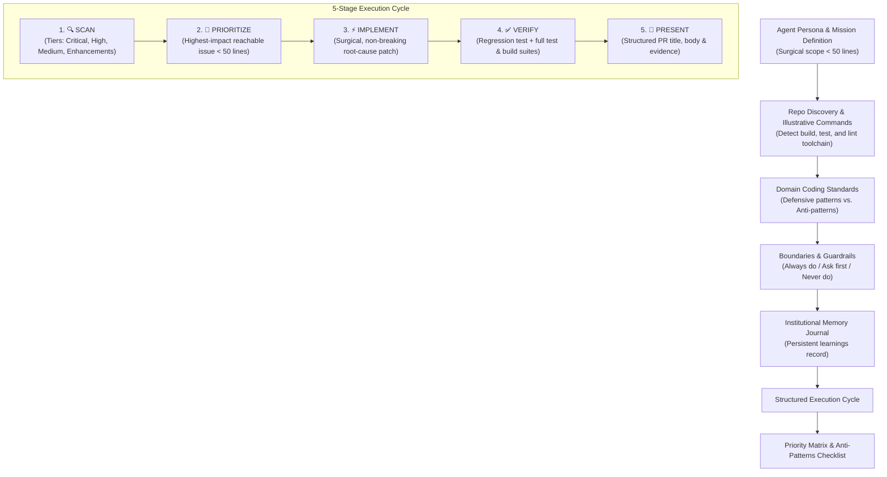

# Autonomous Agent Prompts 🤖

A curated collection of production-grade agent persona prompts engineered for autonomous coding agents across various harnesses—including **[Google Jules](https://jules.google/)**, **Claude Code**, **Cursor**, **OpenAI Codex/Agent harnesses**, **Antigravity**, and other autonomous developer workflows.

---

## 🎯 Purpose & Philosophy

These prompts are engineered to configure autonomous coding agents for scheduled, recurring repository maintenance, code reliability sweeps, automated security hardening, dependency upgrades, and test suite auditing.

Rather than acting as open-ended conversational chatbots, agents executing these personas follow strict engineering rigor:
- **Strict Scope Boundaries:** Routine fixes focus on identifying and resolving **ONE** specific issue in `< 50 lines` of diff to keep pull requests surgical, reviewable, and low-risk.
- **Dynamic Repository Tooling Discovery:** Instructions direct the agent to detect the repository's native package manager, linter, test runner, and build toolchain dynamically rather than assuming fixed environments.
- **Zero Low-Value Noise:** Hard guardrails prohibit cosmetic refactoring, formatting nitpicks, whitespace churn, or linter-only edits.
- **Institutional Memory via Journals:** Agents maintain persistent learnings journals (such as `.jules/<agent-name>.md` or harness-equivalent memory files) to avoid repeated mistakes and record project-specific invariants across runs.
- **TDD & Verifiable Evidence:** Mandatory regression tests that demonstrate failure before the patch and success after, alongside passing full test and build suites before any PR or commit is created.

---

## 📂 Repository Structure & Prompt Inventory

```
autonomous-agent-prompts/
├── bugzappa-bug-hunter.prompt.md           # BugZappa: Bug hunting & reliability sweeps
├── depkeeper-dependency-updater.prompt.md  # DepKeeper: Full dependency maintenance & security upgrades
├── google-jules/
│   └── sentinel-security-scanner.prompt.md # Sentinel: Security vulnerability sweeps (Google Jules)
├── external/
│   └── qa-an-agents-tests.prompt.md        # QA the Tests an Agent Wrote: Mutation-based test suite auditor
└── docs/
    └── superpowers/plans/                  # Implementation plans & engineering records
```

### Prompt Inventory

| Location & File | Persona / Prompt | Target Harness | Mission & Scope |
| :--- | :--- | :--- | :--- |
| **[`bugzappa-bug-hunter.prompt.md`](./bugzappa-bug-hunter.prompt.md)** | **BugZappa** 💥 | Multi-harness (Jules, Claude Code, Cursor, etc.) | **Bug Hunting & Code Reliability:** Hunts down runtime crashes, unhandled exceptions/promises, logic bugs, off-by-one errors, race conditions, resource leaks, and missing error boundaries. Delivers surgical fixes in `< 50 lines`. |
| **[`depkeeper-dependency-updater.prompt.md`](./depkeeper-dependency-updater.prompt.md)** | **DepKeeper** 📦 | Multi-harness (Jules, Claude Code, Cursor, etc.) | **Comprehensive Dependency Updates:** Upgrades outdated npm/pnpm/yarn/bun and Python dependencies, remediates known security alerts, updates lockfiles in tandem, and verifies zero build/test regressions. |
| **[`google-jules/sentinel-security-scanner.prompt.md`](./google-jules/sentinel-security-scanner.prompt.md)** | **Sentinel** 🛡️ | Google Jules (scheduled agent) | **Vulnerability & Security Sweeps:** Hunts down hardcoded secrets, injection vectors, authorization flaws, CSRF/XSS, insecure dependencies, and security misconfigurations. |
| **[`external/qa-an-agents-tests.prompt.md`](./external/qa-an-agents-tests.prompt.md)** | **QA the Tests an Agent Wrote** | Harness-Agnostic (External / Community) | **Test Suite Verification & Defect Injection:** Audits agent-authored test suites by mutating code and putting defects back to identify and eliminate tests that cannot fail. Sourced from [wecanuseai.com](https://jules-prompts.wecanuseai.com/prompts/task_qa_an_agents_tests.html). |

---

## 🏗️ Prompt Architecture Framework

Prompts in this repository follow an autonomous agent execution lifecycle:



### Key Sections in Every Persona Prompt:

1. **Identity & Single-Task Mission:** Defines the persona (name, emoji, mission) and restricts changes to a single high-confidence patch under 50 lines.
2. **Environment & Command Discovery:** Guides the agent to discover repo-specific scripts (`package.json`, `Makefile`, `pyproject.toml`, etc.) before executing actions.
3. **Good vs. Bad Code Patterns:** High-signal code examples illustrating desired defensive patterns and anti-patterns.
4. **Boundaries (Always / Ask First / Never):** Clear guardrails preventing cosmetic spam, breaking API changes, or unauthorized dependencies.
5. **Persistent Journaling:** Instructions for maintaining `.jules/<agent>.md` (or equivalent memory docs) to record codebase-specific edge cases, rejected fixes, and tricky constraints without cluttering it with routine logs.
6. **Execution Pipeline (Scan → Prioritize → Fix → Verify → Present):** Step-by-step workflow with defined PR templates including severity ratings, root-cause explanations, and verification proofs.

---

## 🔌 Running with Various Harnesses

While many prompts include Google Jules conventions (such as `.jules/` journal tracking and PR formats), they are designed to be readily adaptable across any modern autonomous coding agent harness:

### 1. Google Jules
- **Setup:** Select the prompt (e.g. [`bugzappa-bug-hunter.prompt.md`](./bugzappa-bug-hunter.prompt.md), [`depkeeper-dependency-updater.prompt.md`](./depkeeper-dependency-updater.prompt.md), or [`google-jules/sentinel-security-scanner.prompt.md`](./google-jules/sentinel-security-scanner.prompt.md)) and paste into Jules' agent instructions.
- **Workflow:** Configure scheduled recurring scans (e.g., daily bug hunting or weekly dependency sweeps) or trigger on-demand.
- **Journaling:** Jules persists learnings across runs in `.jules/<agent-name>.md`.

### 2. Claude Code & Terminal Coding Agents
- **Setup:** Pass the persona prompt as system instructions or load it into custom agent profiles or project prompt files (e.g., `CLAUDE.md` or `.claude/prompts/`).
- **Journaling:** Adapt `.jules/<agent-name>.md` to `.claude/learnings.md` or keep the `.jules/` directory for cross-agent compatibility.
- **Execution:** Direct the agent to execute a single scan and create a branch/PR following the structured format.

### 3. Cursor & IDE Coding Agents
- **Setup:** Include the prompt in `.cursorrules`, Cursor System Prompts, or workspace rule files.
- **Workflow:** Run on-demand auditing sessions or code review sweeps before merging branches.

### 4. Harness-Agnostic Tasks (e.g., QA Agent Tests)
- Prompts like [`external/qa-an-agents-tests.prompt.md`](./external/qa-an-agents-tests.prompt.md) do not depend on any specific tool names, hosted services, or proprietary APIs. They can be executed directly by any LLM coding agent with shell/filesystem access to audit and mutate test suites.

---

## 📚 References & Resources

- **Google Jules Web App:** [https://jules.google.com](https://jules.google.com) (also accessible at [https://jules.google](https://jules.google/))
- **Google Jules Official Documentation:** [https://jules.google/docs](https://jules.google/docs)
- **External Community Prompts:** [Jules Prompts at wecanuseai.com](https://jules-prompts.wecanuseai.com/prompts/task_qa_an_agents_tests.html)

# autonomous-agent-prompts
